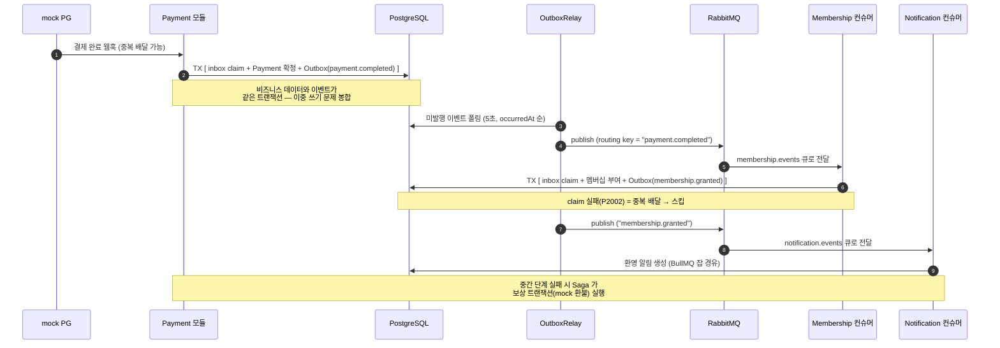
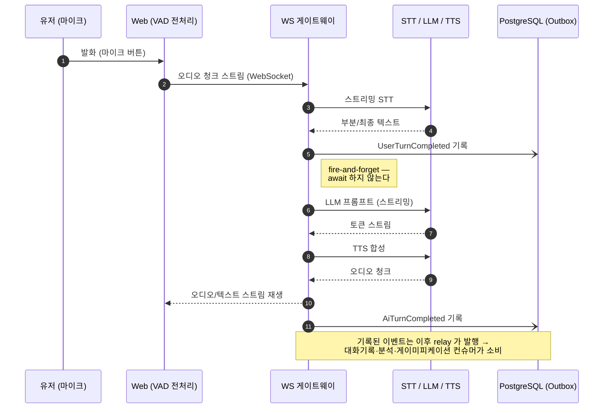
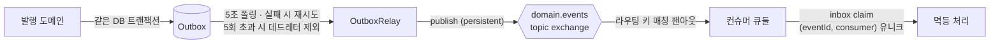

# 통신 아키텍처 다이어그램

시스템의 통신 채널별 프로토콜·스타일·전달 보장, 그리고 핵심 흐름 2개의 시퀀스.

## 통신 채널 요약

| 경로 | 기술 | 스타일 | 보장 / 특성 |
|---|---|---|---|
| Web ↔ API | tRPC (HTTP) | 동기 요청/응답 | 타입 공유 (AppRouter) |
| Web ↔ 튜터링 | WebSocket | 실시간 양방향 스트리밍 | 저지연 우선, 이벤트 인프라 미경유 |
| 모듈 내부 | @nestjs/cqrs CommandBus/QueryBus | 인프로세스 동기 | 유스케이스 오케스트레이션 |
| 컨텍스트 간 | Outbox → RabbitMQ topic exchange | 비동기 pub/sub | **at-least-once** + 멱등 컨슈머 (inbox) |
| 무거운 작업 | BullMQ (Redis) | 비동기 잡 큐 | 재시도·백오프·지연 실행 |
| mock PG → API | HTTP 웹훅 | 비동기 콜백 | 중복·순서역전 가정 → inbox 멱등 처리 |

## 시퀀스 1 — 결제 → 멤버십 부여 (이벤트 전파 + Saga)

트랜잭셔널 아웃박스와 멱등 컨슈머가 협력하는 신뢰성 경로.

## 시퀀스 2 — 실시간 튜터링 핫패스 + 이벤트 탭

핫패스는 스트리밍으로 흐르고, 도메인 이벤트는 옆으로 흘리기만 한다
("이벤트로 통지하되, 이벤트로 진행하지 않는다").

## 전달 보장의 계층

- 발행 측: 트랜잭셔널 아웃박스 (핫패스 이벤트만 best-effort fire-and-forget)
- 전달: at-least-once — 중복은 정상 상황으로 간주
- 소비 측: create-first inbox claim 으로 중복 무해화
- 상세 규약: [event-catalog.md](../event-catalog.md)
