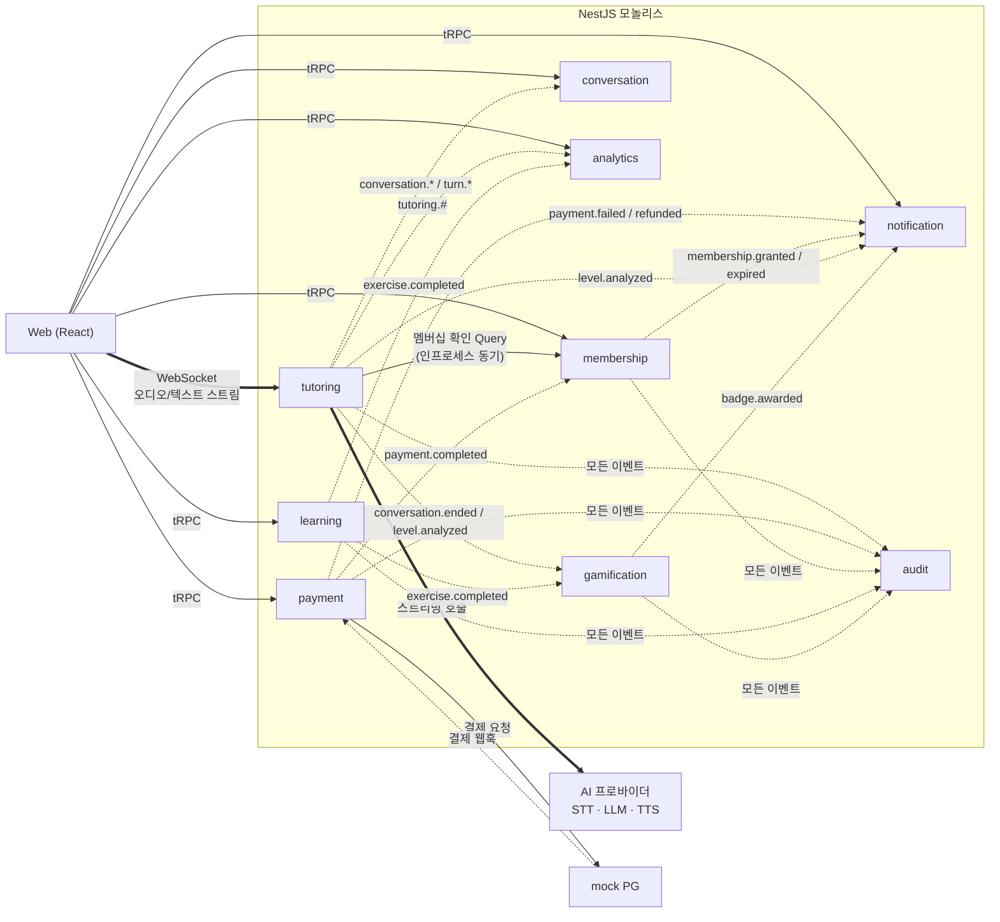
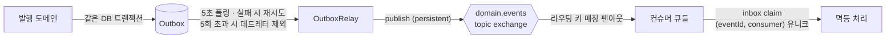
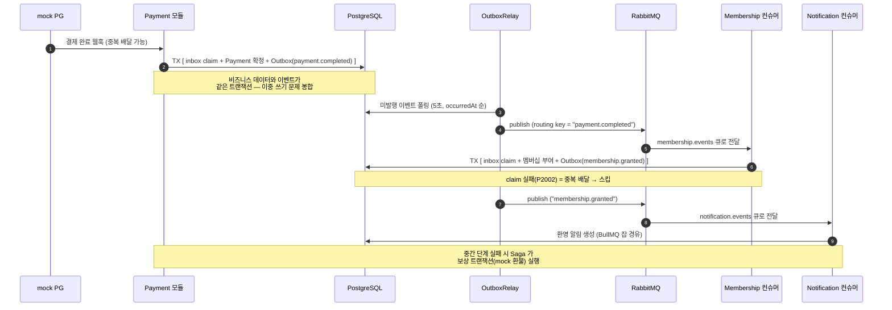
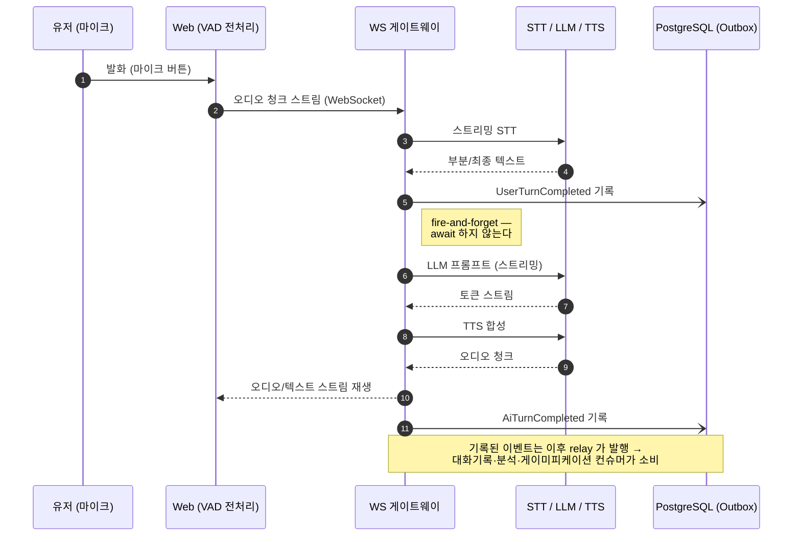

# 통신 아키텍처 다이어그램

**모듈 단위로 누가 누구와, 동기인지 비동기인지**를 보여주는 지도.

범례: **실선 →** 동기 요청/응답 · **굵은 선 ⇒** 실시간 스트리밍 · **점선 ⇢** 비동기 (이벤트/웹훅/잡)

> 점선(이벤트)은 실제로는 모듈끼리 직접 닿지 않고 전부 outbox → RabbitMQ topic exchange 를
> 경유한다 (전달 보장은 아래 참고). 이 다이어그램에서는 "누가 누구에게"를 읽기 쉽게 논리적
> 관계로 축약했다. 물리 경로는 [system-overview.md](./system-overview.md) 참고.

## 통신 방식 결정 규칙

| 관계 | 방식 | 메커니즘 | 이유 |
|---|---|---|---|
| Web → 각 모듈 (조회·명령) | **동기** | tRPC (HTTP) | 사용자 요청/응답, 타입 공유 |
| Web ↔ tutoring | **실시간 스트리밍** | WebSocket | 지연 시간 NFR — 이벤트 인프라 미경유 |
| tutoring → membership | **동기** | 인프로세스 QueryBus | 접속 전 권한 확인은 즉답이 필요한 **읽기** |
| tutoring → AI 프로바이더 | **동기 스트리밍** | HTTP/WS | 핫패스 |
| payment → mock PG | **동기** | HTTP | 결제 시작 요청 |
| mock PG → payment | **비동기** | 웹훅 (중복·순서역전 가정) | 실제 PG 의 통지 방식 시뮬레이션 |
| **컨텍스트 간 상태 변경 전파 전부** | **비동기** | outbox → RabbitMQ (at-least-once) | 발행자가 구독자를 모르는 디커플링 |
| 무거운 작업 (레벨분석·알림 생성·만료) | **비동기 (셀프)** | BullMQ (Redis) | 재시도·백오프·지연 실행 |

**원칙**: 컨텍스트 사이를 넘는 **상태 변경의 전파는 예외 없이 비동기(이벤트)** 다.
동기 호출이 허용되는 곳은 두 가지뿐 — ① 클라이언트 경계(tRPC/WS), ② 즉답이 필요한
**읽기 전용 Query** (tutoring → membership 멤버십 확인). 동기 화살표가 이 둘 밖에서
발견되면 아키텍처 위반이다.

## 전달 보장의 계층 (비동기 경로의 내부)

- 발행 측: 트랜잭셔널 아웃박스 (핫패스 이벤트만 best-effort fire-and-forget)
- 전달: at-least-once — 중복은 정상 상황으로 간주
- 소비 측: create-first inbox claim 으로 중복 무해화
- 상세 규약: [event-catalog.md](../event-catalog.md)

---

## 부록: 상세 시퀀스

### A. 결제 → 멤버십 부여 (이벤트 전파 + Saga)

### B. 실시간 튜터링 핫패스 + 이벤트 탭

