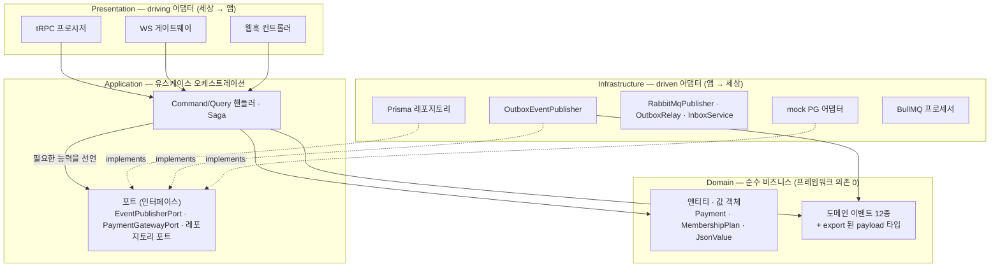
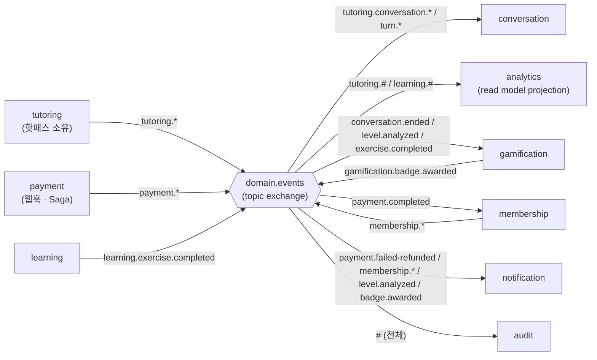
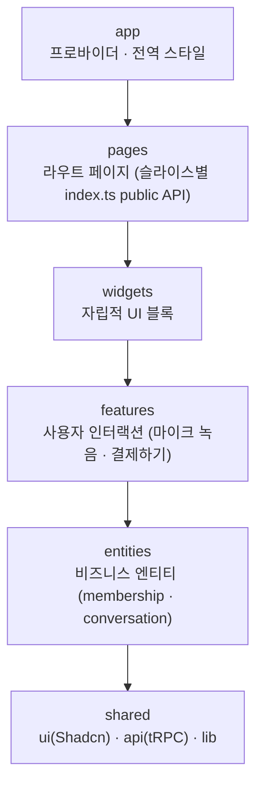

# 논리 아키텍처 다이어그램

코드의 논리적 구조 — 백엔드의 헥사고날 계층, 바운디드 컨텍스트 간 이벤트 관계, 프론트엔드의 FSD 레이어.

## 1. 헥사고날 계층과 의존성 방향 (apps/api)

의존성 화살표는 항상 **바깥 → 안**. 포트(인터페이스)는 안쪽이 소유하고 바깥이 구현한다
(consumer-owned interface, 의존성 역전).

- **Domain**: "우리 비즈니스에서 무엇이 참인가". NestJS/Prisma/amqplib 임포트 금지.
- **Application**: "유스케이스를 어떤 순서로 진행하는가". 외부 능력은 포트로만 선언 — 포트는
  인프라의 정의가 아니라 애플리케이션의 요구사항 명세다.
- **Infrastructure**: 포트의 기술 구현. DI(`shared.module.ts`)가 런타임에 포트와 구현을 연결한다.
- **Presentation**: driving 어댑터. 이론상 infrastructure 와 같은 급(바깥 계층)이며 편의상 분리.

## 2. 바운디드 컨텍스트 이벤트 관계도

발행자는 구독자를 모른다 — 모든 관계는 topic exchange 의 라우팅 키 바인딩으로만 성립한다.

- gamification 은 컨슈머이자 발행자다 (이벤트 체인: 뱃지 조건 충족 → badge.awarded 발행).
- membership 은 payment.completed 를 구독해 구매 Saga 의 다음 단계를 수행한다.
- 큐 이름·바인딩 패턴의 정본은 [event-catalog.md](../event-catalog.md)의 바인딩 표.

## 3. 프론트엔드 FSD 레이어 (apps/web)

상위 레이어만 하위 레이어를 임포트할 수 있고, 동일 레이어 슬라이스 간 임포트는 금지된다 (ADR-002).

- 백엔드 바운디드 컨텍스트와 entities/features 가 대체로 1:1 로 정렬된다.
- FSD 의 단방향 임포트 규칙은 헥사고날의 "바깥 → 안" 의존 규칙과 같은 원리다.
- 서버 상태는 TanStack Query(tRPC), 클라이언트 상태는 슬라이스 `model/` 의 Zustand.
