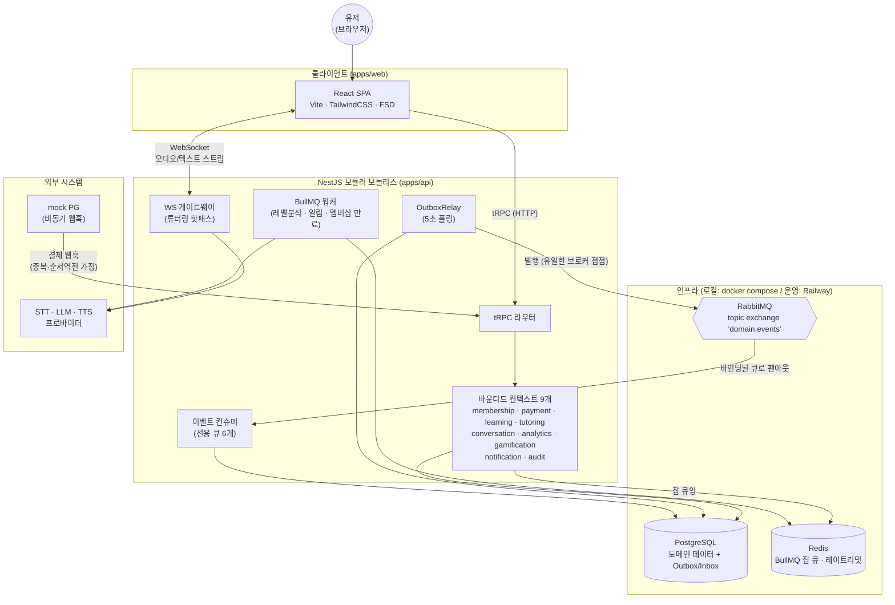

# 상위 시스템 구성 다이어그램

시스템을 구성하는 배포 단위와 인프라, 외부 시스템의 전체 지도.
아키텍처 결정 근거는 [spec.md](../../spec.md)의 ADR-001/002, 이벤트 상세는 [event-catalog.md](../event-catalog.md) 참고.

## 구성 원칙

- **모듈러 모놀리스**: 물리적으로 하나의 NestJS 프로세스이지만, 논리적으로는 9개 바운디드 컨텍스트가
  이벤트로만 통신한다. 이벤트 경계가 곧 미래의 서비스 분리 경계다 (Monolith First).
- **브로커 접점 단일화**: RabbitMQ 에 직접 발행하는 컴포넌트는 OutboxRelay 하나뿐이다 (ADR-001 제약 4).
  백본을 Redis Streams 로 교체할 때 수정 범위가 relay + 컨슈머 어댑터로 국한된다.
- **핫패스 격리**: 실시간 음성 파이프라인(WS 게이트웨이 → AI 프로바이더)은 이벤트 인프라를 통과하지 않는다.
  RabbitMQ 가 완전히 죽어도 대화는 계속된다.
- **mock PG**: 실 결제는 제외 범위. PaymentGatewayPort 뒤의 mock 어댑터가 비동기 웹훅(중복 전송 포함)을
  시뮬레이션해 분산 메시징의 실패 모드를 학습한다.
