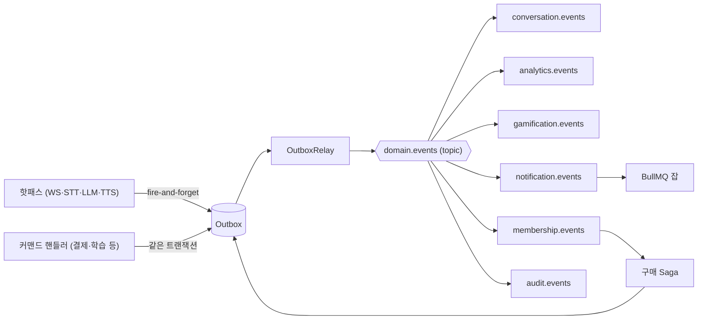

# 이벤트 카탈로그

모든 도메인 이벤트의 단일 출처 문서. 발행자·구독자·전달 보장을 정의한다.
아키텍처 원칙은 [spec.md](../spec.md)의 ADR-001 참고.

## 컨벤션

### 이벤트 봉투 (브로커 중립)

모든 이벤트는 아래 JSON 봉투로 직렬화되어 topic exchange `domain.events` 에 발행된다.
코드 상 정의: `apps/api/src/shared/domain/event-envelope.ts`

```json
{
  "eventId": "uuid — 멱등성 판단 기준",
  "eventType": "tutoring.conversation.ended — 라우팅 키와 동일",
  "occurredAt": "ISO 8601",
  "version": 1,
  "payload": { }
}
```

### 명명 규칙

- `eventType` = RabbitMQ 라우팅 키 = `<context>.<subject>.<action>` (일부는 `<context>.<action>`)
- 이벤트 클래스는 발행 도메인의 `domain/events/` 에 정의한다.
- 컨슈머는 클래스를 임포트하지 않고 봉투 JSON 을 수신한다. 필요한 것은 payload 타입뿐.

### 전달 보장 2단계

| 등급 | 방식 | 대상 |
|---|---|---|
| **보장 (transactional)** | 비즈니스 데이터와 같은 Prisma 트랜잭션에서 outbox 기록 (`publishAllInTx`) | 결제, 멤버십, 학습, 게이미피케이션, 레벨 분석 |
| **best-effort (fire-and-forget)** | outbox 기록을 await 하지 않음 — 실패해도 대화 진행에 영향 없음 | 튜터링 핫패스 이벤트 4종 |

공통: outbox → `OutboxRelay`(5초 폴링) → RabbitMQ. 전달은 **at-least-once**이며
모든 컨슈머는 `InboxService` 로 `(eventId, consumer)` 멱등 처리를 해야 한다.

---

## 이벤트 목록

### tutoring (AI 튜터링)

| eventType (라우팅 키) | 트리거 | payload | 구독자 → 반응 |
|---|---|---|---|
| `tutoring.conversation.started` | 대화 화면 접속, 세션 시작 | sessionId, userId, startedAt | conversation → 세션 생성<br>analytics → 사용량 미터링<br>audit |
| `tutoring.turn.user-completed` | 답변완료 버튼 → STT 확정 | sessionId, userId, seq, text, speakingSeconds | conversation → 턴 저장<br>analytics → 발화 지표·사용량<br>audit |
| `tutoring.turn.ai-completed` | AI 응답 생성 완료 | sessionId, userId, seq, text | conversation → 턴 저장<br>audit |
| `tutoring.conversation.ended` | 세션 종료 | sessionId, userId, endedAt, turnCount, totalSpeakingSeconds | conversation → 세션 종료 처리<br>analytics → 세션 집계<br>gamification → 스트릭 갱신<br>audit |
| `tutoring.level.analyzed` | BullMQ 레벨 분석 잡 완료 (프리미엄) | reportId, userId, sessionId, level, summary | notification → 결과 알림<br>gamification → 첫 측정·레벨업 뱃지<br>audit |

핫패스 4종(started/turn/ended)은 best-effort, `level.analyzed` 는 transactional.

### payment (결제)

| eventType | 트리거 | payload | 구독자 → 반응 |
|---|---|---|---|
| `payment.completed` | mock PG 웹훅 수신·검증 후 (웹훅 중복은 inbox 로 차단) | paymentId, userId, plan, amountKrw, pgTransactionId | membership → **Saga 시작**: 멤버십 부여<br>audit |
| `payment.failed` | mock PG 실패 웹훅 | paymentId, userId, plan, reason | notification → 실패 안내<br>audit |
| `payment.refunded` | Saga 보상 트랜잭션(mock 환불) 완료 | paymentId, userId, reason | notification → 환불 안내<br>audit |

### membership (멤버십)

| eventType | 트리거 | payload | 구독자 → 반응 |
|---|---|---|---|
| `membership.granted` | 구매 Saga 의 멤버십 부여 단계 | membershipId, userId, plan, expiresAt | notification → 환영 알림<br>audit |
| `membership.expired` | 만료 시점 도달 (BullMQ delayed job) | membershipId, userId, plan | notification → 만료 안내<br>audit |

### learning (학습)

| eventType | 트리거 | payload | 구독자 → 반응 |
|---|---|---|---|
| `learning.exercise.completed` | 예제(빈칸/독해/단어) 풀이 완료 | attemptId, userId, exerciseType, isCorrect | analytics → 예제 지표<br>gamification → 스트릭·뱃지<br>audit |

### gamification (게이미피케이션)

| eventType | 트리거 | payload | 구독자 → 반응 |
|---|---|---|---|
| `gamification.badge.awarded` | 뱃지 조건 충족 | userId, badgeCode | notification → 뱃지 획득 알림<br>audit |

conversation / analytics / notification / audit 은 발행 이벤트가 없는 컨슈머 전용 컨텍스트다.

---

## 컨슈머 큐 바인딩

모듈별 전용 큐 하나씩. 큐 이름 = inbox `consumer` 식별자.

| 큐 | 바인딩 패턴 | 처리 내용 |
|---|---|---|
| `conversation.events` | `tutoring.conversation.*`, `tutoring.turn.*` | ConversationSession / ConversationTurn 영속화 |
| `analytics.events` | `tutoring.#`, `learning.#` | DailyLearningStat projection 갱신 |
| `gamification.events` | `tutoring.conversation.ended`, `tutoring.level.analyzed`, `learning.exercise.completed` | Streak / Badge 갱신, BadgeAwarded 발행 |
| `membership.events` | `payment.completed` | 구매 Saga: 멤버십 부여 |
| `notification.events` | `payment.failed`, `payment.refunded`, `membership.*`, `tutoring.level.analyzed`, `gamification.badge.awarded` | Notification 생성 (BullMQ 잡 경유) |
| `audit.events` | `#` | AuditLog 기록 |

## 흐름 요약



## Saga / 잡 연계

**프리미엄 구매 Saga** (payment 모듈 소유):
`payment.completed` → GrantMembershipCommand → `membership.granted` → 환영 알림 커맨드.
중간 실패 시 RefundPaymentCommand (보상) → `payment.refunded`.

**BullMQ 잡** (이벤트가 트리거하는 무거운 작업):
- 레벨 분석: 분석 요청 커맨드 → 잡 큐잉 → LLM 분석 → `tutoring.level.analyzed` 발행
- 멤버십 만료: 부여 시 delayed job 등록 → 만료 시 `membership.expired` 발행
- 알림 생성: notification 컨슈머가 잡 큐잉 → 워커가 Notification 생성

## 스키마 변경 규칙

- payload 는 **하위 호환 변경만** 허용 (필드 추가 OK, 삭제·타입 변경 금지).
- 파괴적 변경이 필요하면 `version` 을 올리고 컨슈머가 분기 처리한 뒤, 전체 마이그레이션 후 구버전 분기를 제거한다.

## 구현 상태

- 스캐폴드에는 이벤트 클래스와 발행 인프라(Outbox/Relay/RabbitMQ 어댑터)만 존재. 컨슈머는 미구현.
- 컨슈머 구현 시 이 문서의 바인딩 표를 따르고, 비즈니스 처리와 **같은 트랜잭션** 안에서
  `InboxService.tryMarkProcessed` 를 먼저 호출한다 — false 면 이미 처리된 이벤트이므로 스킵 (create-first 멱등성).
- 발행 실패가 `MAX_PUBLISH_ATTEMPTS`(5회)에 도달한 outbox 행은 데드레터로 간주되어 relay 조회에서
  제외된다. `failureCount >= 5` 조회로 확인하고 수동 조치한다.
- 컨슈머 어댑터는 amqplib 직접 구현 또는 `@golevelup/nestjs-rabbitmq`(`@RabbitSubscribe` 데코레이터) 중 선택 — 후자가 보일러플레이트가 적다.
